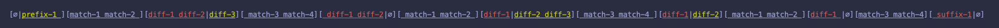
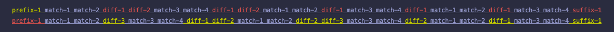

## app.tulz.diff

Myers diff algorithm in Scala. 


```scala
"app.tulz" %%% "stringdiff" % "0.3.4" 
```

### Overview

The core algorithm is a Scala translation of the Python implementation described here:
https://blog.robertelder.org/diff-algorithm/

Additionally, the following is implemented on top of it:

* interpretation of the algorithm's output
* customizable formatting of the interpreted result into a string (with a few provided out of the box formatters)  
* additional transformations for when the input is expected to be a sequence of tokens (`TokenDiff`)


### Interpretation

The core algorithm outputs a set of instructions to get from `SeqA` to `SeqB`, something like this:

```
in order to get from s1="bcdefgzio" to s2="abcxyfgi":

Insert a from s2 before position 0 into s1.
Delete d from s1 at position 2 in s1.
Insert x from s2 before position 3 into s1.
Insert y from s2 before position 3 into s1.
Delete e from s1 at position 3 in s1.
Delete z from s1 at position 6 in s1.
Delete o from s1 at position 8 in s1.
```

It's hard to work with it. Also, it is somewhat tricky at first to understand how to follow these instructions (try it! :) ).

`MyersInterpret` object parses the raw output into a `List[DiffElement]`:

```scala
trait DiffElement[Repr]

object DiffElement {
  final case class InBoth[Repr](v: Repr)        extends DiffElement[Repr]
  final case class InFirst[Repr](v: Repr)       extends DiffElement[Repr]
  final case class InSecond[Repr](v: Repr)      extends DiffElement[Repr]
  final case class Diff[Repr](x: Repr, y: Repr) extends DiffElement[Repr]
}
```

The result of the interpretation (without any transformations applied) for the same example:

```scala
StringDiff
  .raw(
    "bcdefgzio",
    "abcxyfgi",
    collapse = false
  ).mkString("[\n  ", "\n  ", "\n]")
```

```
[
  InSecond(a)
  InBoth(bc)
  InFirst(d)
  InSecond(x)
  InSecond(y)
  InFirst(e)
  InBoth(fg)
  InFirst(z)
  InBoth(i)
  InFirst(o)
]
```

### Collapsing

By default, diff functions will collapse the diff:

```scala
StringDiff
  .raw(
    "bcdefgzio",
    "abcxyfgi",
    collapse = true // default is true
  ).mkString("[\n  ", "\n  ", "\n]")
```

```
[
  InSecond(a)
  InBoth(bc)
  Diff(de,xy)
  InBoth(fg)
  InFirst(z)
  InBoth(i)
  InFirst(o)
]
```

Here, the following list of `DiffElement`s:

```
[
  InFirst(d)
  InSecond(x)
  InSecond(y)
  InFirst(e)
]
```

got collapsed into a single one:

```
[
  Diff(de,xy)
]
```

In a nutshell, collapsing removes empty elements and joins same or otherwise "join-able" subsequent `DiffElement`s.

Examples:
* any `InFirst`, `InLast`, `Diff` or `InBoth` gets removed if the element is empty
* `Diff` becomes `InFirst` or `InSecond` if one the elements is empty
* `InFirst(a)+InFirst(b) -> InFirst(ab)`
* `InFirst(a)+InSecond(b) -> Diff(a,b)`
* `InSecond(a)+InDiff(b,c) -> Diff(ab,c)`
* etc

### Diff'ing sequences:

```scala
SeqDiff
  .seq(
    Seq(1, 2, 3, 4, 5).toIndexedSeq,
    Seq(1, 2, 8, 3, 8, 4, 5, 0).toIndexedSeq
  ).mkString("[\n  ", "\n  ", "\n]")
```

```
[
  InBoth(Vector(1, 2))
  InSecond(Vector(8))
  InBoth(Vector(3))
  InSecond(Vector(8))
  InBoth(Vector(4, 5))
  InSecond(Vector(0))
]
```

### Diff'ing strings:

##### Raw diff AST:

```scala
  println(
    StringDiff.diff(
      "bcdefgzio",
      "abcxyfgi"
    )
  )
```

```  
[
  InSecond(a)
  InBoth(bc)
  Diff(de,xy)
  InBoth(fg)
  InFirst(z)
  InBoth(i)
  InFirst(o)
]  
```

##### Text output:

```scala
  println(
    StringDiff.text(
      "bcdefgzio",
      "abcxyfgi"
    )
  )
```

```
[∅|a]]bc][de|xy]]fg][z|∅]]i][o|∅]
```

##### ANSI color output:

```scala
  println(
    StringDiff.ansi(
      "bcdefgzio",
      "abcxyfgi"
    )
  )
```


(default formatters highlight missing text with yellow, extraneous text — with red, and matching text is underlined)

### Diff'ing tokens

When the inputs are strings that are expected to contain whitespace-separated tokens, `TokenDiff` 
will try to make the diff more comprehensible in terms of tokens (while preserving the accuracy).

```scala
  println(
    TokenDiff.ansi(
      "match-1 match-2 diff-1 diff-2 match-3 match-4 diff-1 diff-2 match-1 match-2 diff-1 match-3 match-4 diff-1 match-1 match-2 diff-1 match-3 match-4 suffix-1",
      "prefix-1 match-1 match-2 diff-3 match-3 match-4 match-1 match-2 diff-2 diff-3 match-3 match-4 diff-2 match-1 match-2 match-3 match-4"
    )    
  )
```



With a `StringDiff` the output would look like the following:

```scala
  println(
    StringDiff.ansi(
      "match-1 match-2 diff-1 diff-2 match-3 match-4 diff-1 diff-2 match-1 match-2 diff-1 match-3 match-4 diff-1 match-1 match-2 diff-1 match-3 match-4 suffix-1",
      "prefix-1 match-1 match-2 diff-3 match-3 match-4 match-1 match-2 diff-2 diff-3 match-3 match-4 diff-2 match-1 match-2 match-3 match-4"
    )    
  )
```


##### Inline diffs for both strings 

```scala
  println(
    TokenDiff.ansiBoth(
      "match-1 match-2 diff-1 diff-2 match-3 match-4 diff-1 diff-2 match-1 match-2 diff-1 match-3 match-4 diff-1 match-1 match-2 diff-1 match-3 match-4 suffix-1",
      "prefix-1 match-1 match-2 diff-3 match-3 match-4 match-1 match-2 diff-2 diff-3 match-3 match-4 diff-2 match-1 match-2 match-3 match-4"
    )    
  )
```




### Usage

##### Diff'ing `Seq`s:

```
SeqDiff.seq(
  Seq(1, 2, 3),
  Seq(2, 3, 4)
)
```

##### Diff'ing `Strings`s:

```
StringDiff.ansi("abc", "acb")
// OR
StringDiff("abc", "acb")

StringDiff.ansiBoth("abc", "acb")
StringDiff.text("abc", "acb")
StringDiff.diff("abc", "acb")
StringDiff.raw("abc", "acb")
```


##### Diff'ing `Strings`s with tokens:

```
TokenDiff.ansi("abc", "acb")
// OR
TokenDiff("abc", "acb")

TokenDiff.ansiBoth("abc", "acb")
TokenDiff.text("abc", "acb")
TokenDiff.diff("abc", "acb")
TokenDiff.raw("abc", "acb")
```


### Custom formatters

Formatters are instances of the `DiffFormat[Out]` trait:

```scala
trait DiffFormat[Out] {

  def apply(diff: List[DiffElement[String]]): Out

}
```

```scala
object MyFormat extends DiffFormat[MyDiffOutput] { ... }

val diff: MyDiffOutput = MyFormat(StringDiff("abc", "acb"))
```

For example, the `TextDiffFormat` is implemented like this:

```scala
object TextDiffFormat extends DiffFormat[String] {

  import DiffElement._

  def apply(diff: List[DiffElement[String]]): String = {
    val sb = new StringBuilder
    diff.foreach {
      case InBoth(both) =>
        sb.append("]")
        sb.appendAll(both)
        sb.append("]")
      case InSecond(second) =>
        sb.append("[∅|")
        sb.appendAll(second)
        sb.append("]")
      case InFirst(first) =>
        sb.append("[")
        sb.appendAll(first)
        sb.append("|∅]")
      case Diff(first, second) =>
        sb.append("[")
        sb.appendAll(first)
        sb.append("|")
        sb.appendAll(second)
        sb.append("]")
      case _ =>
    }
    sb.toString()
  }
```

## Author

Iurii Malchenko – [@yurique](https://twitter.com/yurique)


## License

`stringdiff` is provided under the [MIT license](https://github.com/tulz-app/stringdiff/blob/main/LICENSE.md).
