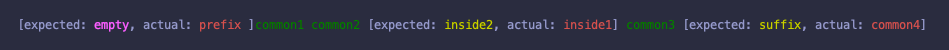

### app.tulz.diff

A library for diff-ing strings.

```scala
"app.tulz" %%% "stringdiff" % "0.2.0" 
```

### Usage

#### Output with ANSI colors:

```scala
import app.tulz.diff._

StringDiff("prefix common1 common2 inside1 common3 common4", "common1 common2 inside2 common3 suffix")
// or 
StringDiff.withFormat("prefix common1 common2 inside1 common3 common4", "common1 common2 inside2 common3 suffix")(AnsiColorDiffFormat)
```


#### Output without colors

```scala
import app.tulz.diff._

StringDiff.text("prefix common1 common2 inside1 common3 common4", "common1 common2 inside2 common3 suffix")
// or 
StringDiff.withFormat("prefix common1 common2 inside1 common3 common4", "common1 common2 inside2 common3 suffix")(TextDiffFormat)
```

```
[prefix |∅]common1 common2 [inside1 |inside2 ]common3 [∅|suffix]
```

#### Raw AST

```scala
import app.tulz.diff._

StringDiff.raw("prefix common1 common2 inside1 common3 common4", "common1 common2 inside2 common3 suffix") // List[DiffBlock]
// OR
StringDiff.withFormat("prefix common1 common2 inside1 common3 common4", "common1 common2 inside2 common3 suffix")(RawDiffFormat) // List[DiffBlock]
```

```scala
List(
  Extra(List("prefix", " ")), 
  Match(List("common1", " ", "common2", " ")), 
  Different(List("inside1", " "),List("inside2", " ")), 
  Match(List("common3", " ")), 
  Missing(List("suffix"))
)
```

#### Custom format

```scala
import app.tulz.diff.StringDiff
import scala.Console._

val customFormat: DiffFormat[String] = (diff: List[DiffBlock]) =>
  diff.map {
    case DiffBlock.Match(m)                    => m.mkString
    case DiffBlock.Missing(expected)           => s"[missing: ${YELLOW}${expected.mkString}${RESET}]"
    case DiffBlock.Extra(actual)               => s"[extra: ${RED}${actual.mkString}${RESET}]"
    case DiffBlock.Different(actual, expected) => s"[expected: ${YELLOW}${expected.mkString}${RESET}, actual: ${RED}${actual.mkString}${RESET}]"
  }.mkString

StringDiff.withFormat("prefix common1 common2 inside1 common3 common4", "common1 common2 inside2 inside3 common3 suffix")(customFormat)
StringDiff.withFormat("common1 common2 inside1 inside2 common3 common4 suffix", "prefix common1 common2 inside3 common3")(customFormat)
```



### Examples

```
token1 token2 token3
token1 token2 token3
```

<pre style="background-color: #222">
<span>token1 token2 token3</span>
</pre>

---

```
prefix1 match1 match2 match3
prefix2 match1 match2 match3
```

<pre style="background-color: #222">
[<span style="color:#A50">prefix2</span>|<span style="color:#A00">prefix1</span>] match1 match2 match3
</pre>

---

```
match1 match2 match3 suffix1
match1 match2 match3 suffix2
```

<pre style="background-color: #222">
match1 match2 match3 [<span style="color:#A50">suffix2</span>|<span style="color:#A00">suffix1</span>]
</pre>

---

```
match1 match2 inside1 match3
match1 match2 inside2 match3
```

<pre style="background-color: #222">
match1 match2 [<span style="color:#A50">inside2</span>|<span style="color:#A00">inside1</span>] match3
</pre>

---

```
prefix1 match1 match2 inside1 match3 suffix1
prefix2 match1 match2 inside2 match3 suffix2
```

<pre style="background-color: #222">
[<span style="color:#A50">prefix2</span>|<span style="color:#A00">prefix1</span>] match1 match2 [<span style="color:#A50">inside2</span>|<span style="color:#A00">inside1</span>] match3 [<span style="color:#A50">suffix2</span>|<span style="color:#A00">suffix1</span>]
</pre>

---

```
prefix1 match1 match2 match3
match1 match2 match3
```

<pre style="background-color: #222">
[<span style="color:#A50">∅</span>|<span style="color:#A00">prefix1 </span>]match1 match2 match3
</pre>

---

```
match1 match2 match3
prefix1 match1 match2 match3
```

<pre style="background-color: #222">
[<span style="color:#A50">prefix1 </span>|<span style="color:#A00">∅</span>]match1 match2 match3
</pre>

---

```
match1 match2 match3 suffix1
match1 match2 match3
```

<pre style="background-color: #222">
match1 match2 match3[<span style="color:#A50">∅</span>|<span style="color:#A00"> suffix1</span>]
</pre>

---

```
match1 match2 match3
match1 match2 match3 suffix1
```

<pre style="background-color: #222">
match1 match2 match3[<span style="color:#A50"> suffix1</span>|<span style="color:#A00">∅</span>]
</pre>

---

```
prefix1 match1 match2 match3 suffix1
match1 match2 match3
```

<pre style="background-color: #222">
[<span style="color:#A50">∅</span>|<span style="color:#A00">prefix1 </span>]match1 match2 match3[<span style="color:#A50">∅</span>|<span style="color:#A00"> suffix1</span>]
</pre>

---

```
prefix1 match1 match2 match3 suffix1
match1 match2 match3
```

<pre style="background-color: #222">
[<span style="color:#A50">∅</span>|<span style="color:#A00">prefix1 </span>]match1 match2 match3[<span style="color:#A50">∅</span>|<span style="color:#A00"> suffix1</span>]
</pre>

---

```
match1 match2 match3
prefix1 match1 match2 match3 suffix1
```

<pre style="background-color: #222">
[<span style="color:#A50">prefix1 </span>|<span style="color:#A00">∅</span>]match1 match2 match3[<span style="color:#A50"> suffix1</span>|<span style="color:#A00">∅</span>]
</pre>

---

```
prefix1 match1 match2 inside1 match3 match4 suffix1
match1 match2 match3 match4
```

<pre style="background-color: #222">
[<span style="color:#A50">∅</span>|<span style="color:#A00">prefix1 </span>]match1 match2 [<span style="color:#A50">∅</span>|<span style="color:#A00">inside1 </span>]match3 match4[<span style="color:#A50">∅</span>|<span style="color:#A00"> suffix1</span>]
</pre>

---

```
match1 match2 match3 match4
prefix1 match1 match2 inside1 match3 match4 suffix1
```

<pre style="background-color: #222">
[<span style="color:#A50">prefix1 </span>|<span style="color:#A00">∅</span>]match1 match2 [<span style="color:#A50">inside1 </span>|<span style="color:#A00">∅</span>]match3 match4[<span style="color:#A50"> suffix1</span>|<span style="color:#A00">∅</span>]
</pre>

---

```
match1 match2 inside1 match3 match4
prefix1 match1 match2 match3 match4 suffix1
```

<pre style="background-color: #222">
[<span style="color:#A50">prefix1 </span>|<span style="color:#A00">∅</span>]match1 match2 [<span style="color:#A50">∅</span>|<span style="color:#A00">inside1 </span>]match3 match4[<span style="color:#A50"> suffix1</span>|<span style="color:#A00">∅</span>]
</pre>

---

```
prefix1 match1 match2 match3 match4 suffix1
match1 match2 inside1 match3 match4
```

<pre style="background-color: #222">
[<span style="color:#A50">∅</span>|<span style="color:#A00">prefix1 </span>]match1 match2 [<span style="color:#A50">inside1 </span>|<span style="color:#A00">∅</span>]match3 match4[<span style="color:#A50">∅</span>|<span style="color:#A00"> suffix1</span>]
</pre>

---


## Author

Iurii Malchenko – [@yurique](https://twitter.com/yurique)


## License

`stringdiff` is provided under the [MIT license](https://github.com/tulz-app/stringdiff/blob/main/LICENSE.md).
