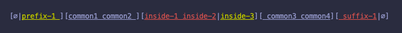

### app.tulz.diff

A library for diff-ing strings.

```scala
"app.tulz" %%% "stringdiff" % "0.1.0" 
```


```scala
import app.tulz.diff.StringDiff

StringDiff("prefix common1 common2 inside1 common3 common4", "common1 common2 inside2 common3 suffix")
// or 
StringDiff.default("prefix common1 common2 inside1 common3 common4", "common1 common2 inside2 common3 suffix")
```


```scala
import app.tulz.diff.StringDiff

StringDiff.xml("prefix common1 common2 inside1 common3 common4", "common1 common2 inside2 common3 suffix")
```

```xml
<diff><no-match><expected><empty/></expected><actual>prefix </actual></no-match><match>common1 common2 </match><no-match><expected>inside2</expected><actual>inside1</actual></no-match><match> common3 </match><no-match><expected>suffix</expected><actual>common4</actual></no-match></diff>
```


```scala


import scala.Console._

val diff = new StringDiff(
  beforeAll = "",
  beforeNoMatch = "[",
  beforeExpected = s"expected: ${YELLOW}",
  afterExpected = RESET,
  between = ", ",
  beforeActual = s"actual: ${RED}",
  afterActual = RESET,
  empty = s"${MAGENTA}empty${RESET}",
  afterNoMatch = "]",
  beforeMatch = GREEN,
  afterMatch = RESET,
  afterAll = ""
)

diff("prefix common1 common2 inside1 common3 common4", "common1 common2 inside2 common3 suffix")

// custom
```


### More examples

```
token1 token2 token3
token1 token2 token3
```

<pre style="background-color: #222">
<span>token1 token2 token3</span>
</pre>

---

```
prefix1 match1 match2 match3
prefix2 match1 match2 match3
```

<pre style="background-color: #222">
[<span style="color:#A50">prefix2</span>|<span style="color:#A00">prefix1</span>] match1 match2 match3
</pre>

---

```
match1 match2 match3 suffix1
match1 match2 match3 suffix2
```

<pre style="background-color: #222">
match1 match2 match3 [<span style="color:#A50">suffix2</span>|<span style="color:#A00">suffix1</span>]
</pre>

---

```
match1 match2 inside1 match3
match1 match2 inside2 match3
```

<pre style="background-color: #222">
match1 match2 [<span style="color:#A50">inside2</span>|<span style="color:#A00">inside1</span>] match3
</pre>

---

```
prefix1 match1 match2 inside1 match3 suffix1
prefix2 match1 match2 inside2 match3 suffix2
```

<pre style="background-color: #222">
[<span style="color:#A50">prefix2</span>|<span style="color:#A00">prefix1</span>] match1 match2 [<span style="color:#A50">inside2</span>|<span style="color:#A00">inside1</span>] match3 [<span style="color:#A50">suffix2</span>|<span style="color:#A00">suffix1</span>]
</pre>

---

```
prefix1 match1 match2 match3
match1 match2 match3
```

<pre style="background-color: #222">
[<span style="color:#A50">∅</span>|<span style="color:#A00">prefix1 </span>]match1 match2 match3
</pre>

---

```
match1 match2 match3
prefix1 match1 match2 match3
```

<pre style="background-color: #222">
[<span style="color:#A50">prefix1 </span>|<span style="color:#A00">∅</span>]match1 match2 match3
</pre>

---

```
match1 match2 match3 suffix1
match1 match2 match3
```

<pre style="background-color: #222">
match1 match2 match3[<span style="color:#A50">∅</span>|<span style="color:#A00"> suffix1</span>]
</pre>

---

```
match1 match2 match3
match1 match2 match3 suffix1
```

<pre style="background-color: #222">
match1 match2 match3[<span style="color:#A50"> suffix1</span>|<span style="color:#A00">∅</span>]
</pre>

---

```
prefix1 match1 match2 match3 suffix1
match1 match2 match3
```

<pre style="background-color: #222">
[<span style="color:#A50">∅</span>|<span style="color:#A00">prefix1 </span>]match1 match2 match3[<span style="color:#A50">∅</span>|<span style="color:#A00"> suffix1</span>]
</pre>

---

```
prefix1 match1 match2 match3 suffix1
match1 match2 match3
```

<pre style="background-color: #222">
[<span style="color:#A50">∅</span>|<span style="color:#A00">prefix1 </span>]match1 match2 match3[<span style="color:#A50">∅</span>|<span style="color:#A00"> suffix1</span>]
</pre>

---

```
match1 match2 match3
prefix1 match1 match2 match3 suffix1
```

<pre style="background-color: #222">
[<span style="color:#A50">prefix1 </span>|<span style="color:#A00">∅</span>]match1 match2 match3[<span style="color:#A50"> suffix1</span>|<span style="color:#A00">∅</span>]
</pre>

---

```
prefix1 match1 match2 inside1 match3 match4 suffix1
match1 match2 match3 match4
```

<pre style="background-color: #222">
[<span style="color:#A50">∅</span>|<span style="color:#A00">prefix1 </span>]match1 match2 [<span style="color:#A50">∅</span>|<span style="color:#A00">inside1 </span>]match3 match4[<span style="color:#A50">∅</span>|<span style="color:#A00"> suffix1</span>]
</pre>

---

```
match1 match2 match3 match4
prefix1 match1 match2 inside1 match3 match4 suffix1
```

<pre style="background-color: #222">
[<span style="color:#A50">prefix1 </span>|<span style="color:#A00">∅</span>]match1 match2 [<span style="color:#A50">inside1 </span>|<span style="color:#A00">∅</span>]match3 match4[<span style="color:#A50"> suffix1</span>|<span style="color:#A00">∅</span>]
</pre>

---

```
match1 match2 inside1 match3 match4
prefix1 match1 match2 match3 match4 suffix1
```

<pre style="background-color: #222">
[<span style="color:#A50">prefix1 </span>|<span style="color:#A00">∅</span>]match1 match2 [<span style="color:#A50">∅</span>|<span style="color:#A00">inside1 </span>]match3 match4[<span style="color:#A50"> suffix1</span>|<span style="color:#A00">∅</span>]
</pre>

---

```
prefix1 match1 match2 match3 match4 suffix1
match1 match2 inside1 match3 match4
```

<pre style="background-color: #222">
[<span style="color:#A50">∅</span>|<span style="color:#A00">prefix1 </span>]match1 match2 [<span style="color:#A50">inside1 </span>|<span style="color:#A00">∅</span>]match3 match4[<span style="color:#A50">∅</span>|<span style="color:#A00"> suffix1</span>]
</pre>

---


## Author

Iurii Malchenko – [@yurique](https://twitter.com/yurique)


## License

`stringdiff` is provided under the [MIT license](https://github.com/tulz-app/stringdiff/blob/main/LICENSE.md).
